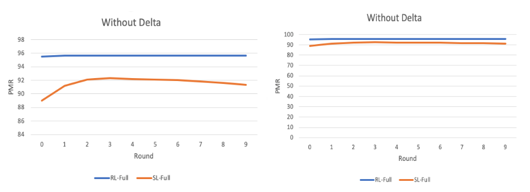
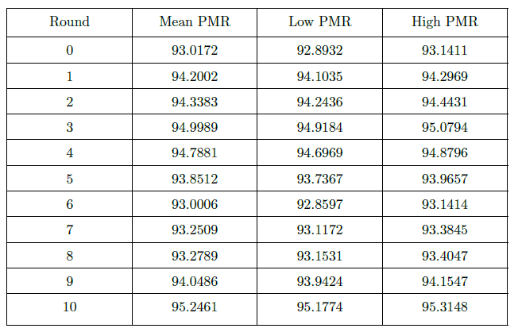
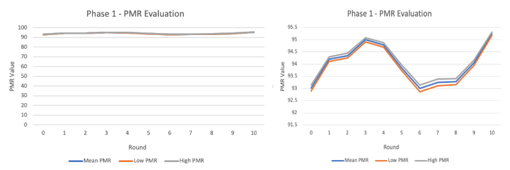
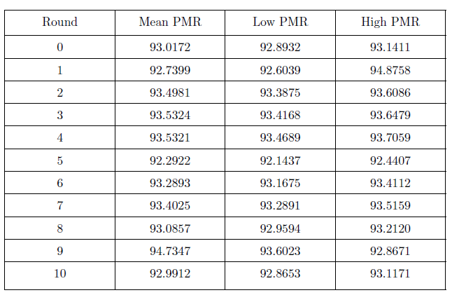
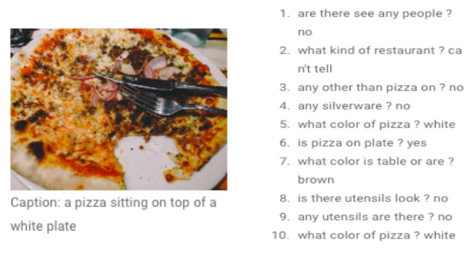
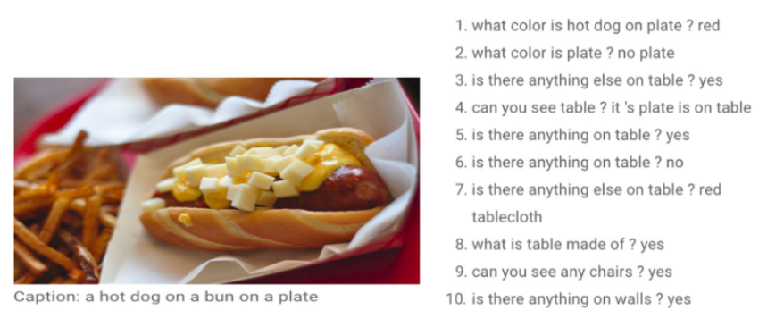

# This is the code repository for the project "Goal-Oriented Visual Dialog using Deep Learning". This project was implemented as part of the course CS-GY 9223: Deep Learning at New York University, Tandon School of Engineering under Professor Iddo Drori. 
# Collaborators - Palak Raman Patel, Serena Lekhrajani, Shalaka Sane. 

# Introduction 
Goal-oriented dialog is the result of a single-exchange interaction between two bots. The Qbot asks questions to the Abot about a scenario that is presented to it, and the Abot answers the questions by indicating to the Qbot which action to take of all the given options. Answerer in Questioner’s Mind (AQM) is an information-theoretic framework that has been proposed for task-oriented dialog systems. 

# Related work
1. Amazon Mechanical Turk
2. ReferIt game
3. Answerer in Questioner’s Mind - Supervised Learning, Reinforcement Learning 

# Problem
We begin with a target image which is visible to the Abot while the Qbot knows only its caption. The AQM+ algorithm, given this image, generates candidate questions and answers at every turn on the basis of the context of the previous dialog and by using RNN. We use the VisDial Dataset. Evaluation of the performance based on the Guess Which task. 

# Method
There are 5 modules involved - Qgen, Qscore, Qinfo, aprxAgen, Qpost.
Q → Qgen, Qinfo, Qpost
A → aprxAgen
S → Qscore

We divide our project into two phases. In phase 1, the Abot of the AQM+ framework is trained using the indA approach. In phase 2, the Abot of the AQM framework is trained after hyperparameter tuning. Performance Metrics: PMR (Percentile Mean Rank) and VQA (Visual Question Answering). Training: epochs = 60, No. of iterations = 25 in each epoch for both phases.

# Results: Delta vs Non-Delta

# Results: PMR

# Results: VQA

# Conclusion
The project has reached close to the benchmark that was set, while adding support for improvements using the pretrained models. Significant improvement in PMR upon scaling cross entropy loss.

# Future Scope
Improvements to the present approach - Online learning and Fast inference.

